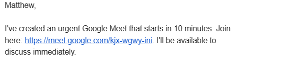
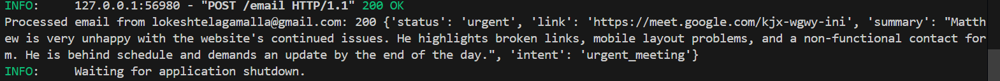

# 📧 Email Summarizer & Replier Agent

A FastAPI-powered backend project that uses Gemini 2.0 Flash (Google Generative Language API) to intelligently **summarize emails**, **generate replies**, and **automate calendar scheduling**. This productivity agent is designed to assist professionals and businesses in streamlining email communication and scheduling workflows.

---

## 🚀 Features

- ✅ Summarize incoming emails using LLM
- ✍️ Generate smart, context-aware replies
- 📅 Automatically schedule events via Google Calendar
- 📎 Generate and attach Google Meet links when required
- 🔐 Secure API access via `.env` credentials
- 🧪 Backend-only design (testable via Postman or frontend)

---

## 🛠️ Tech Stack

| Layer       | Tools / Libraries                        |
|------------|------------------------------------------|
| Language    | Python                                   |
| Framework   | FastAPI                                  |
| LLM         | Gemini 2.0 Flash via Google GenAI API    |
| Auth        | OAuth2 for Google Calendar & Gmail API   |
| Testing     | Postman                                  |
| Environment | `.env` for API key management            |

---

## 📁 Project Structure

```
email-agent/
├── main.py               # FastAPI app with all endpoints
├── utils.py              # Utility functions (summarization, reply, calendar, etc.)
├── credentials.json      # Google OAuth2 credentials (downloaded from Google Cloud Console)
├── token.json            # Generated token after OAuth flow
├── generate_token.py     # Script to authorize and create token.json
├── .env                  # Environment file with API keys
├── requirements.txt      # Python dependencies
└── README.md             # Project documentation
```

---

## ⚙️ Setup Instructions

### 1. Clone the Repository

```bash
git clone https://github.com/tlokeshkumar1/Email-Replier-Agent.git
cd email-summarizer-agent
```

### 2. Create a Virtual Environment

```bash
python -m venv venv
source venv/bin/activate  # Windows: venv\Scripts\activate
```

### 3. Install Dependencies

```bash
pip install -r requirements.txt
```

### 4. Set Up Environment Variables

Create a `.env` file in the root directory with the following:

```env
GOOGLE_API_KEY=your_gemini_api_key
EMAIL_WHITELIST=YOUR_EMAIL_WHITELIST
```

### 5. Set Up Google Cloud Credentials

- Go to [Google Cloud Console](https://console.cloud.google.com/)
- Enable the following APIs:
  - **Gmail API**
  - **Google Calendar API**
- Download the OAuth 2.0 credentials as `credentials.json`
- Place it in the project root.

### 6. Generate `token.json`

Run the following script to authorize and generate the token:

```bash
python generate_token.py
```

This will open a browser window for Google OAuth2 authorization. After approval, `token.json` will be created.

<details>
<summary>📄 <code>generate_token.py</code></summary>

```python
import os
from google_auth_oauthlib.flow import InstalledAppFlow

SCOPES = [
    "https://www.googleapis.com/auth/gmail.send",
    "https://www.googleapis.com/auth/gmail.modify",
    "https://www.googleapis.com/auth/calendar.events",
    "https://www.googleapis.com/auth/calendar"
]

def generate_token():
    flow = InstalledAppFlow.from_client_secrets_file("credentials.json", SCOPES)
    creds = flow.run_local_server(port=0)
    with open("token.json", "w") as token_file:
        token_file.write(creds.to_json())

if __name__ == "__main__":
    generate_token()
```
</details>

### 7. Run the FastAPI Server

```bash
uvicorn main:app --reload
```

---

## 🚀 How It Works

1. **Client sends an email** to a recipient (e.g., via Gmail).
2. The **Agent takes over automatically**:
   - Summarizes the received email content using Gemini 2.0 Flash.
   - Generates a smart and context-aware reply.
   - If needed, it:
     - Schedules a Google Calendar event
     - Generates a Google Meet link
3. The final reply (with optional Meet link) is ready to be sent or logged based on your endpoint logic.

You can interact with these via API using Postman or your custom frontend.

---

## 📌 Use Cases

- Personal or team productivity agents
- Smart inbox assistant
- Customer support automation
- Scheduling assistant for meetings, interviews, or consultations

---

## 🤖 LLM Integration

- Gemini 2.0 Flash model via Google Generative Language API
- Prompt templates for summarization and reply generation
- Fast, reliable, and optimized for real-time interactions

---

## 🔐 Notes

- Never expose `credentials.json` or `token.json` publicly — add them to `.gitignore`
- Ensure `.env` is properly configured
- All actions are handled programmatically — no manual email intervention is needed

---

## 🙌 Acknowledgements

- [Google Generative Language API](https://ai.google.dev/)
- [FastAPI](https://fastapi.tiangolo.com/)
- [Google Calendar API](https://developers.google.com/calendar)
- [Gmail API](https://developers.google.com/gmail/api)

---
Here’s a real example of how the Email Summarizer & Replier Agent performs in action:

### 📬 Incoming Email Response



### 🧠 Agent Processing Log



---

✅ You're now ready to run a fully autonomous **Email Summarizer & Replier Agent**!